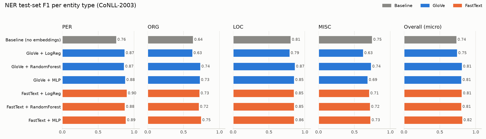

# KLab AI — Nadia Teta

This repository contains my work for the KLab AI course: Python fundamentals, data wrangling, regression, classification, a Kaggle competition, and natural language processing (an SMS spam classifier, word embeddings, and Named Entity Recognition with word embeddings).

Every number in this README comes from the saved outputs of the notebooks in this repository.

## Projects at a glance

| # | Project | Notebook | Topic | Headline result |
|---|---|---|---|---|
| 1 | Day 1: Python for AI | [day01_python_fundamentals.ipynb](notebooks/day01_python_fundamentals.ipynb) | Python, NumPy, Pandas, Matplotlib | Exercises + chart + reflection |
| 2 | Assignment 2: Data wrangling & regression | [assignment2_data_wrangling.ipynb](notebooks/assignment2_data_wrangling.ipynb) | Medical insurance costs | Smokers pay on average 32,050 vs 8,441 for non-smokers |
| 3 | High-charge classification | [classification.ipynb](notebooks/classification.ipynb) | Logistic Regression vs Random Forest | Test recall 0.918 (Logistic Regression, chosen) |
| 4 | Movie rating classifier | [movie_rating.ipynb](notebooks/movie_rating.ipynb) | K-Nearest Neighbours | Test accuracy 0.804 |
| 5 | Spaceship Titanic (Kaggle) | [spaceship_titanic.ipynb](notebooks/spaceship_titanic.ipynb) + [ITERATION.md](ITERATION.md) | Iterative modelling, gradient boosting | Best leaderboard score 0.8078 |
| 6 | SMS spam classifier | [spam_classifier.ipynb](notebooks/spam_classifier.ipynb) | TF-IDF + Linear SVM | Catches 93.1% of spam on unseen messages |
| 7 | Evaluating unsupervised models (lab) | [Evaluating Unsupervised Models - Lab.ipynb](notebooks/Evaluating%20Unsupervised%20Models%20-%20Lab.ipynb) | K-Means, GMM, DBSCAN, PCA | Choosing k without labels |
| 8 | Word embeddings exploration | [word_embeddings.ipynb](notebooks/word_embeddings.ipynb) | Pre-trained GloVe vectors | king − man + woman = queen |
| 9 | **Named Entity Recognition with word embeddings** | [ner_embeddings.ipynb](notebooks/ner_embeddings.ipynb) + [src/ner_utils.py](src/ner_utils.py) + demo [app.py](app.py) | CoNLL-2003, GloVe, FastText | Overall F1 0.737 → 0.819 with embeddings |

## Project structure

```text
klab-ai-NadiaTeta/
│
├── data/
│   ├── raw/
│   │   ├── insurance.csv            # Medical Cost Personal dataset (projects 2, 3)
│   │   ├── IMDB-Movie-Data.csv      # IMDB movies (project 4)
│   │   └── spam.csv                 # SMS Spam Collection (project 6)
│   ├── processed/
│   │   └── insurance_cleaned.csv    # output of project 2
│   ├── rwanda_ner_test.txt          # hand-labelled Rwandan NER test set (project 9)
│   └── embeddings/                  # FastText vectors cached here at runtime (gitignored, ~1.2 GB)
│
├── notebooks/                       # one notebook per project (see table above)
│
├── src/
│   └── ner_utils.py                 # reusable NER helpers (project 9)
├── models/                          # saved NER models for the demo app (project 9)
├── app.py                           # Gradio demo app for the NER models (project 9)
│
├── reports/
│   ├── day01_chart.png, day01_reflection.md
│   ├── a2_chart1.png, a2_chart2.png, a3_chart1.png, weekend-a2-report.md
│   ├── length_chart.png, model_comparison.png, confusion_matrix.png, top_words.png
│   └── ner_f1_comparison.png
│
├── screenshots/                     # Kaggle submission screenshots (project 5)
├── ITERATION.md                     # Spaceship Titanic iteration log
├── .gitignore
├── requirements.txt
└── README.md
```

## Setup

Requirements: Python 3.12 (or a compatible Python 3 version), Git, VS Code with the Jupyter extension, and an internet connection (for installing packages and downloading datasets and embeddings).

### 1. Clone the repository

```bash
git clone https://github.com/NadiaTeta/klab-ai-NadiaTeta.git
cd klab-ai-NadiaTeta
```

### 2. Create and activate a virtual environment

On Windows PowerShell:

```powershell
python -m venv .venv
.venv\Scripts\Activate.ps1
```

After activation, the terminal should show `(.venv)`. If PowerShell prevents activation, run:

```powershell
Set-ExecutionPolicy -ExecutionPolicy RemoteSigned -Scope CurrentUser
```

Then activate the environment again.

### 3. Install dependencies

```powershell
pip install -r requirements.txt
```

This installs everything the notebooks need, including NumPy, Pandas, scikit-learn, Matplotlib, Jupyter, NLTK (spam classifier), gensim (word embeddings), Hugging Face `datasets` and `seqeval` (NER), and Gradio (the NER demo app).

### 4. Smoke test

Open `notebooks/day01_python_fundamentals.ipynb`, select the `.venv` kernel and run the first cell:

```python
import numpy, pandas, sklearn, matplotlib

print("all good")
```

Expected output: `all good`.

### 5. Run a notebook

Open any notebook in VS Code, select the Python interpreter from the project's `.venv`, then use **Kernel → Restart** followed by **Run All**. Each notebook runs from top to bottom.

---

## 1. Day 1: Python for AI

[notebooks/day01_python_fundamentals.ipynb](notebooks/day01_python_fundamentals.ipynb)

- **Python fundamentals:** five data types, type casting, f-strings, conditionals, loops and `enumerate()`, lists / tuples / dictionaries / sets, list and dictionary comprehensions.
- **Three functions** with docstrings, sensible defaults and edge-case handling: `normalise()`, `summarise_scores()`, `safe_divide()`.
- **NumPy and Pandas:** 1-D and 2-D arrays, statistics, shapes and transposes, broadcasting, DataFrames, missing values, filtering, sorting and derived columns.
- **Visualisation:** a Matplotlib chart saved as `reports/day01_chart.png`.
- **Reflection:** [reports/day01_reflection.md](reports/day01_reflection.md).

## 2. Assignment 2: Data wrangling and regression (medical insurance)

[notebooks/assignment2_data_wrangling.ipynb](notebooks/assignment2_data_wrangling.ipynb) · report: [reports/weekend-a2-report.md](reports/weekend-a2-report.md)

**Question:** how do smoking, region and age relate to medical insurance charges?

- **Data:** `data/raw/insurance.csv` (Medical Cost Personal dataset, Kaggle), 1,338 rows × 7 columns. No missing values; 1 duplicate removed (1,337 rows). The cleaned data is saved to `data/processed/insurance_cleaned.csv`.
- **Wrangling:** group-by on smoker status merged back onto every row, a region × smoker pivot table, z-scores of charges.
- **Findings:** smokers pay on average **32,050** vs **8,441** for non-smokers (medians 34,456 vs 7,346). Smokers in the southeast pay the most (34,845 on average), and the smoker gap holds in every region. These are associations, not causes.
- **Regression (predicting charges from age and BMI, 80/20 split):**

| Model | MAE | RMSE | R² |
|---|---|---|---|
| Linear Regression | 9,575.76 | 12,559.72 | 0.142 |
| Random Forest Regressor | 10,048.56 | 14,016.62 | −0.069 |

Linear Regression did better, but both models are weak because smoker status (the strongest factor) was not used as a feature.

- **Charts:** `reports/a2_chart1.png` (average charges by smoker status), `reports/a2_chart2.png` (age vs charges), `reports/a3_chart1.png` (actual vs predicted charges).

## 3. High-charge classification (medical insurance)

[notebooks/classification.ipynb](notebooks/classification.ipynb)

- **Task:** predict whether a person's charges are **above the median** (9,382.03); the two classes are balanced (669 / 669).
- **Features:** age, BMI, number of children, smoker. Stratified 80/20 split (1,070 train / 268 test).
- **Results on the test set:**

| Model | Accuracy | Precision | Recall | F1 |
|---|---|---|---|---|
| Logistic Regression | 0.899 | 0.885 | 0.918 | 0.901 |
| Random Forest | 0.929 | 0.967 | 0.888 | 0.926 |

- **Chosen model: Logistic Regression.** Random Forest is better on accuracy, precision and F1, but missing a high-cost person is the more expensive mistake, so I optimised for **recall**, where Logistic Regression wins.

## 4. Movie rating classifier (KNN)

[notebooks/movie_rating.ipynb](notebooks/movie_rating.ipynb)

- **Task:** predict whether an IMDB movie is rated **7.0 or higher**.
- **Data:** `data/raw/IMDB-Movie-Data.csv`, 1,000 movies; 838 remain after dropping rows with missing revenue or Metascore.
- **Method:** features Year, Runtime, Votes, Revenue and Metascore; standardised; `KNeighborsClassifier(n_neighbors=5)`; stratified 80/20 split (670 / 168). The notebook also shows the 5 nearest neighbours of one test movie.
- **Result:** test accuracy **0.804** (precision / recall around 0.80 for both classes).

## 5. Spaceship Titanic (Kaggle competition)

[notebooks/spaceship_titanic.ipynb](notebooks/spaceship_titanic.ipynb) · iteration log: [ITERATION.md](ITERATION.md) · screenshots: [screenshots/](screenshots/)

- **Task:** predict which passengers were `Transported`. I changed one thing at a time and measured each change with 5-fold stratified cross-validation (CV).
- **Pipeline:** scikit-learn `Pipeline` + `ColumnTransformer` (imputation, scaling, one-hot encoding), engineered features (group, deck, cabin side, total spend, group size, a leakage-safe group transport rate, ...), models from Logistic Regression to Random Forest, Histogram Gradient Boosting (tuned with `GridSearchCV`) and CatBoost.
- **Data:** the notebook was run on Kaggle (`/kaggle/input/...`). The competition CSVs are not stored in this repo; to run it locally, download them from Kaggle and set the `SPACESHIP_DATA` environment variable to their folder.

| Change | CV accuracy | Leaderboard |
|---|---|---|
| Baseline Logistic Regression | 0.7860 | 0.7905 |
| + engineered features | 0.7921 | 0.7928 |
| Gradient boosting | 0.8085 | 0.8045 |
| Tuned gradient boosting | 0.8123 | 0.8055 |
| + group transport rate | 0.8128 | **0.8078** |
| CatBoost | **0.8150** | 0.8034 |

- **Lesson learned:** at first the submission cell kept submitting an old model, so three different models got the same leaderboard score (0.8045). After fixing that, the best leaderboard score was **0.8078** (tuned gradient boosting + group transport rate). CatBoost had the best CV score but the lowest leaderboard score of the three, a reminder that CV and leaderboard don't always agree.

## 6. SMS spam classifier

[notebooks/spam_classifier.ipynb](notebooks/spam_classifier.ipynb)

- **Data:** `data/raw/spam.csv` (SMS Spam Collection), 5,572 messages; 5,169 after removing 403 duplicates (4,516 ham, 653 spam).
- **Cleaning:** lowercase, URLs → `url`, numbers → `num`, letters only, stopwords removed (NLTK), Porter stemming.
- **Features:** TF-IDF on single words and word pairs (`ngram_range=(1, 2)`, `min_df=2`) → 5,790 features.
- **Models (5-fold CV on the training set):**

| Model | Accuracy | Precision | Recall | F1 |
|---|---|---|---|---|
| **Linear SVM** | 0.985 | 0.946 | 0.935 | 0.940 |
| Naive Bayes | 0.977 | 0.998 | 0.818 | 0.898 |
| Logistic Regression | 0.972 | 0.859 | 0.931 | 0.893 |

- **Final test result (Linear SVM, 1,034 unseen messages):** accuracy **0.983**; spam precision and recall both **0.931** (122 of 131 spam messages caught). For comparison, a baseline that always says "ham" gets 87.3% accuracy but catches 0% of spam.
- **Charts:** `reports/length_chart.png`, `reports/model_comparison.png`, `reports/confusion_matrix.png`, `reports/top_words.png`.

## 7. Evaluating unsupervised models (lab)

[notebooks/Evaluating Unsupervised Models - Lab.ipynb](notebooks/Evaluating%20Unsupervised%20Models%20-%20Lab.ipynb)

How do you judge a clustering model when there are no labels? On synthetic data (1,200 points in 4 true clusters), the lab compares K-Means, Gaussian Mixture Models, DBSCAN and PCA using silhouette, Davies-Bouldin, held-out log-likelihood / BIC, bootstrap stability and (because the true clusters are known) ARI / NMI.

- **K-Means with k = 4:** silhouette 0.533, ARI 0.855.
- **Choosing k:** silhouette picked **k = 3** while the true k is 4. Internal scores can miss the right answer.
- **GMM:** held-out log-likelihood and BIC both picked **4 components**, the correct number.
- **DBSCAN:** no `eps` value recovered the 4 clusters.
- **Scaling matters:** ARI 0.416 unscaled vs 0.858 standardised. Adding noise features dropped ARI from 0.855 to 0.002.

## 8. Word embeddings exploration

[notebooks/word_embeddings.ipynb](notebooks/word_embeddings.ipynb)

A first look at pre-trained **GloVe** vectors (`glove-wiki-gigaword-50` via gensim: 50 numbers per word, trained on Wikipedia and news):

- Words closest to "free": allowing, allowed, giving, for, without.
- Similarity: cheap vs affordable **0.71**, cheap vs banana **0.40**.
- Analogy: king − man + woman = **queen**.
- The SMS slang words "wif", "lar", "lor" and "tkts" are all in GloVe's vocabulary.

---

## 9. Named Entity Recognition (NER) with word embeddings

[notebooks/ner_embeddings.ipynb](notebooks/ner_embeddings.ipynb) · reusable code: [src/ner_utils.py](src/ner_utils.py) · Rwandan test set: [data/rwanda_ner_test.txt](data/rwanda_ner_test.txt)

### The problem

**Named Entity Recognition** finds the names in a text and says what kind of thing each one is: a person (PER), an organisation (ORG), a location (LOC) or another name (MISC, e.g. nationalities and events).

> *WASAC announced that water will be cut in **Kicukiro** and **Gikondo** on Friday.* → WASAC = ORG, Kicukiro = LOC, Gikondo = LOC

NER is useful wherever you need to turn free text into structured data: who, which organisation, where. My future capstone needs exactly this: extracting **Rwandan locations** from water-supply messages.

The question of this project: **do word embeddings help a NER model, compared with representing each word as a separate label?**

### Dataset

- **CoNLL-2003 (English):** Reuters news articles labelled in the **BIO format**: `B-` = beginning of an entity, `I-` = inside it, `O` = not an entity. Four entity types: PER, ORG, LOC, MISC. **There is no DATE type**, so no model here can find dates.
- **Source:** Hugging Face [`eriktks/conll2003`](https://huggingface.co/datasets/eriktks/conll2003), loaded from its automatic parquet copy (`revision="refs/convert/parquet"`), because the original version uses a loading script that newer `datasets` releases no longer run. It has the same data and the same official splits.

| Split | Sentences | Tokens | PER | ORG | LOC | MISC |
|---|---|---|---|---|---|---|
| train | 14,041 | 203,621 | 6,600 | 6,321 | 7,140 | 3,438 |
| validation | 3,250 | 51,362 | 1,842 | 1,341 | 1,837 | 922 |
| test | 3,453 | 46,435 | 1,617 | 1,661 | 1,668 | 702 |

- **Rwandan test set:** [data/rwanda_ner_test.txt](data/rwanda_ner_test.txt), with 15 English sentences about Rwanda (WASAC announcements, places in Kigali and other districts, Rwandan organisations and people) that I labelled by hand in the same BIO format. It has 180 tokens and 35 entities (17 LOC, 13 ORG, 3 MISC, 2 PER).

### Embeddings used, and why

| | GloVe | FastText |
|---|---|---|
| gensim name | `glove-wiki-gigaword-50` | `fasttext-wiki-news-subwords-300` |
| Numbers per word | 50 | 300 |
| Vocabulary | 400,000 words, lowercase only | 999,999 words, case-sensitive |
| Download | ~66 MB | ~1 GB |
| Why | Small and fast, already used in project 8 | Bigger vocabulary; trained with word pieces (subwords) |

FastText learns vectors for **pieces of words** (like `kic`, `icu`, `kir`), so in principle it can build a vector for a word it has never seen. **Note:** the gensim download contains only the final whole-word vectors, not the word-piece table, so in this project it can only look up words that are in its vocabulary. The full model with word pieces is a 4.5 GB download that needs more memory than my laptop has. To show how word pieces work, the notebook trains a small FastText model on the CoNLL text.

### The pipeline

Every model tags **one word at a time**. Only the way each word is described changes:

1. **Baseline (no embeddings):** the word itself (lowercased), the previous and next word, its last 3 letters, plus **spelling features** (starts with a capital? ALL CAPS? has digits or a hyphen? first word of the sentence? neighbours capitalised?). This gives 65,784 mostly-zero columns, and the classifier is Logistic Regression.
2. **With embeddings:** the embedding of the **previous + current + next word**, plus **the same spelling features**. GloVe gives 3 × 50 + 12 = 162 dense columns, and FastText 3 × 300 + 12 = 912. Unknown words get a zero vector. Capital letters are kept as spelling features because GloVe is lowercase and capitals are one of the strongest NER clues.
3. **Three classifiers on each embedding:** Logistic Regression (a straight-line model), Random Forest (100 trees, non-linear) and a small neural network (an MLP with one hidden layer of 256 units and early stopping). All are trained on the **full** training set.
4. **Choices on validation, one final test:** Logistic Regression's `C` was chosen on the validation set from 0.001 to 100. Random Forest and MLP use fixed, reasonable settings. The best model is chosen by **overall validation F1**, and every model is evaluated **once** on the test set with `seqeval`. This means **entity-level** precision, recall and F1 per type: "Eric Niyonzima" only counts as correct if both words get the right tags.

### How to run

1. Complete the [Setup](#setup) above (`pip install -r requirements.txt` installs `gensim`, `datasets` and `seqeval`).
2. Open `notebooks/ner_embeddings.ipynb`, select the `.venv` kernel, and **Run All**.
3. The first run downloads CoNLL-2003 (from Hugging Face), GloVe (~66 MB) and FastText (~1 GB). FastText is saved to `data/embeddings/` and memory-mapped on later runs. None of these files are committed to git (see `.gitignore`).
4. Training all seven models takes a while on a laptop. The FastText models are the slowest, because each word has 912 features.

### Demo

`app.py` is a small [Gradio](https://www.gradio.app/) web page for presenting the models live. You type or paste an English sentence (or click one of the examples), press **Analyze**, and see the **baseline** and the **best model (FastText + MLP)** side by side. Each model's entities are highlighted in colour by type, and a table lists every entity it found.

```powershell
.venv\Scripts\Activate.ps1
python app.py
```

Then open **http://127.0.0.1:7860** in your browser. Stop the app with `Ctrl+C` in the terminal.

- The trained models are saved in `models/` (`baseline.joblib`, `best.joblib`) by the **last cell of the notebook**, so the app starts in seconds without retraining. They are small (about 8 MB together), so they are committed.
- The app opens the FastText vectors memory-mapped from `data/embeddings/`. If that folder doesn't exist yet (for example on a fresh clone), the app downloads FastText (~1 GB) on its first start, or you can run the notebook once first.

The reusable functions live in `src/ner_utils.py`: `load_hf_ner`, `read_conll_file`, `BaselineFeaturizer`, `EmbeddingFeaturizer`, `make_lookup`, `train_logreg_with_validation`, `make_random_forest`, `make_mlp`, `evaluate`, `entity_recall_by_seen` and `predict_entities`. They work with any dataset given as lists of tokens and BIO tags, and with any embedding given as a "word → vector" function. So the same code can be pointed at a Kinyarwanda dataset such as MasakhaNER, or at other vectors.

### Results on the CoNLL-2003 test set

**F1 per entity type** (the best value in each column is in bold):

| Model | PER | ORG | LOC | MISC | Overall F1 (test) | Overall F1 (validation) |
|---|---|---|---|---|---|---|
| Baseline (no embeddings) | 0.758 | 0.638 | 0.808 | **0.752** | 0.737 | 0.838 |
| GloVe + Logistic Regression | 0.874 | 0.628 | 0.792 | 0.627 | 0.746 | 0.777 |
| GloVe + Random Forest | 0.866 | 0.738 | **0.866** | 0.738 | 0.813 | 0.868 |
| GloVe + MLP | 0.883 | 0.732 | 0.855 | 0.690 | 0.806 | 0.867 |
| FastText + Logistic Regression | **0.904** | 0.727 | 0.853 | 0.711 | 0.812 | 0.863 |
| FastText + Random Forest | 0.877 | 0.718 | 0.854 | 0.722 | 0.805 | 0.859 |
| **FastText + MLP (best)** | 0.892 | **0.750** | 0.856 | 0.729 | **0.819** | **0.873** |

**Precision / recall** for the baseline and the best model (test set):

| Model | | PER | ORG | LOC | MISC | Overall |
|---|---|---|---|---|---|---|
| Baseline | precision | 0.711 | 0.627 | 0.801 | 0.730 | 0.715 |
| | recall | 0.811 | 0.650 | 0.815 | 0.775 | 0.760 |
| FastText + MLP | precision | 0.867 | 0.713 | 0.821 | 0.709 | 0.788 |
| | recall | 0.919 | 0.791 | 0.895 | 0.751 | 0.853 |

The precision, recall and F1 of every model are in the notebook.



**Before / after on words never seen in training.** This is the key benefit of embeddings. The test entities are split into those with at least one word seen in training (4,423) and those with none (1,225):

| Model | Recall on seen entities | Recall on unseen entities |
|---|---|---|
| Baseline (no embeddings) | 0.806 | **0.596** |
| GloVe + Random Forest | 0.848 | 0.784 |
| GloVe + MLP | 0.848 | 0.812 |
| FastText + Logistic Regression | 0.852 | 0.793 |
| FastText + MLP | 0.862 | **0.821** |

To the baseline, an unseen word is a column it never learned anything about. Embeddings were trained on billions of words, so a new surname still lands near other surnames.

### Results on the Rwandan test set

The baseline, the best GloVe model and the best FastText model (chosen by validation F1) were evaluated on the 15 Rwandan sentences:

| Model | CoNLL test F1 | Rwanda F1 | Rwanda PER | Rwanda ORG | Rwanda LOC | Rwanda MISC |
|---|---|---|---|---|---|---|
| Baseline (no embeddings) | 0.737 | **0.676** | 0.500 | **0.545** | **0.833** | 0.400 |
| GloVe + Random Forest | 0.813 | 0.597 | 0.667 | 0.385 | 0.718 | **0.667** |
| FastText + MLP | **0.819** | 0.658 | **0.800** | 0.444 | 0.821 | 0.400 |

**The ranking flips on Rwandan text** and every model scores lower than on CoNLL. With only 35 entities this is a rough signal, but the mistakes show clear patterns:

- **"Rwanda" inside organisation names** (Rwanda Development Board, University of Rwanda, MTN Rwanda, Rwanda Utilities Regulatory Authority): the baseline got all four right. Both embedding models usually split "Rwanda" off as a separate LOC, because its embedding is a strong *country* vector. This explains most of the ORG drop.
- **Locations are the good news:** FastText + MLP found 16 of the 17 locations (LOC recall 0.941), including Kicukiro, Gikondo, Nyagatare, Rusizi, Rubavu, Kimironko and Lake Kivu.
- **Domain shift:** CoNLL is 1996 Reuters news. Only 50.0% of the Rwandan entity words appear in the CoNLL training data, against 75.9% that are in GloVe and 85.2% in FastText. Kimironko, Mukamana, Remera and WASAC are in none of them.

### Example outputs

From `predict_entities(sentence)` using the best model (FastText + MLP):

| Sentence | Predicted entities |
|---|---|
| WASAC announced that water will be cut in Kicukiro and Gikondo on Friday. | ORG: WASAC · LOC: Kicukiro · LOC: Gikondo |
| Eric Niyonzima met the president of Kenya in Nairobi. | PER: Eric Niyonzima · MISC: Kenya ✘ · LOC: Nairobi |
| Nadia studies software engineering at the African Leadership University in Kigali. | PER: Nadia · MISC: African ✘ · ORG: Leadership University ✘ · LOC: Kigali |
| Residents of Nyamirambo said WASAC has not restored water since Monday. | LOC: Nyamirambo · ORG: WASAC |

The Rwandan places and WASAC are all found correctly. "Kenya" should be LOC, and "African Leadership University" should be a single ORG; every model splits it, because each word is tagged using only one neighbour on each side. The baseline missed "Nadia" completely, and in the last sentence it tagged Nyamirambo as ORG and WASAC as a person. "Friday" and "Monday" are `O` because CoNLL has no DATE type.

### What improved, what didn't, and why

- **Improved:** overall F1 went from 0.737 (baseline) to 0.819 (FastText + MLP). People (PER) improved the most, from 0.758 to 0.892, and recall on unseen entities went from 0.596 to 0.821.
- **The classifier matters as much as the embedding:** GloVe with Logistic Regression barely beat the baseline (0.746 vs 0.737), and changing `C` hardly mattered. A straight-line model can't combine embedding numbers well. Random Forest and MLP on the same GloVe features reached 0.813 and 0.806.
- **Got worse: MISC.** The baseline (0.752) beats every embedding model. MISC words like "German" repeat constantly in the news and are easy to memorise, while their embeddings sit close to countries (LOC).
- **Still hardest: ORG**, mostly because organisations and places share names (F1 at most 0.750).
- **GloVe vs FastText:** FastText was better with Logistic Regression and the MLP, and GloVe slightly better with Random Forest. FastText's larger vocabulary and case-sensitive vectors help, but it needs far more memory and training time.

### Limitations and next steps

- **No DATE type** in CoNLL-2003, but water-cut alerts need dates ("on Friday"). This needs a dataset with dates, or simple rules.
- **Rwandan names and organisations:** CoNLL is 1996 world news, so Rwandan names are rare in it and "Rwanda + noun" organisations get split. The model needs Rwandan training examples.
- **Small test set:** the Rwandan set has only 15 sentences and 35 entities, so its scores can change a lot with a single entity.
- **Word pieces were not used for NER:** the gensim FastText file has no subword table. A full subword model would build vectors for unknown words like Kimironko or WASAC.
- **One word at a time, with a 3-word window:** contextual models like **BERT** read the whole sentence and give the same word different vectors in different contexts ("Rwanda" the country vs "Rwanda" in "University of Rwanda"). They are the natural next step, as is a Kinyarwanda dataset such as **MasakhaNER** for my capstone.

---

## Reproducibility

A fresh clone should be reproducible by following these steps:

1. Clone the repository.
2. Create the `.venv` virtual environment.
3. Activate `.venv`.
4. Install the dependencies using `requirements.txt`.
5. Open a notebook and select the `.venv` Python kernel.
6. Run the smoke test.
7. Use **Kernel → Restart** followed by **Run All**.

Large files are downloaded at runtime and never committed: the CoNLL-2003 dataset (Hugging Face cache), GloVe and FastText vectors (gensim cache and `data/embeddings/`), and the Spaceship Titanic competition data (Kaggle).

The repository does not contain passwords, API keys, or other secrets.

## Git and environment files

The `.venv/` directory, `.env` file, embedding files and other large data files are excluded from version control through `.gitignore`. The `.env.example` file is provided as an example configuration file and does not contain secrets.
